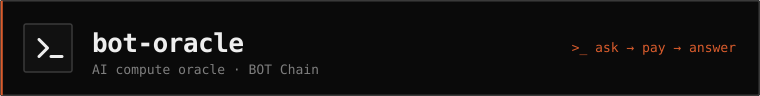

# bot-oracle

The AI compute oracle for BOT Chain. Contracts request inference, off-chain
operator nodes run the models, results land back on-chain; fees flow
through the protocol. Ships with its own demand: Sentinel, an autonomous
consumer that pays for scheduled analyses and stores them on-chain.

## Layout

| Dir | What |
|---|---|
| `contracts/` | Foundry project: coordinator, registries, Sentinel, tests (17 passing) |
| `node/` | Oracle node: getLogs-poller, model backends, fulfiller, Sentinel keeper |
| `gateway/` | HTTP API: `POST /v1/query`, API keys + usage metering |
| `packages/sdk/` | `@bot-oracle/sdk`: request / awaitResult / verifyResult; install `npm i https://raw.githubusercontent.com/DruxAMB/bot-oracle/main/dist/bot-oracle-sdk-0.1.1.tgz` (registry publish pending; npm account in preventive suspension until Oct 2); `test/smoke.mjs` runs a live on-chain round trip |
| `app/` | Next.js dashboard + docs |
| `starter/` | Clonable consumer template for integrators |
| `scripts/` | Chain recon + spike probes (RPC, WS, BDEX, deploy, getLogs) |
| `SPEC.md` | Architecture, monetization, phases, decisions log, deployments |

## Networks

| | Mainnet | Testnet |
|---|---|---|
| Chain ID | 677 | 968 |
| RPC | `https://rpc.botchain.ai` | `https://rpc.bohr.life` |
| Explorer | `https://scan.botchain.ai` | `https://scan.bohr.life` |

## Quickstart (testnet)

```bash
cd contracts && forge install --no-git foundry-rs/forge-std OpenZeppelin/openzeppelin-contracts
forge test                        # 17 tests

cd ../node && npm i
OPERATOR_KEY=<funded-key> COORDINATOR_ADDRESS=<addr> MODELS_ADDRESS=<addr> \
RPC_URL=https://rpc.bohr.life CHAIN_ID=968 node src/index.js

cd ../gateway && npm i
GATEWAY_KEY=<funded-key> COORDINATOR_ADDRESS=<addr> MODELS_ADDRESS=<addr> \
GATEWAY_KEYS="yourkey:100" node src/index.js
curl -X POST localhost:8791/v1/query -H "x-api-key: yourkey" \
  -H "content-type: application/json" -d '{"model":"echo","prompt":"hi"}'
```

## Trust model (v1)

Single staked operator, slashable via a challenge window; honest
centralization, documented. Multi-operator consensus then TEE/opML proofs are
the roadmap. See `SPEC.md` §3.4.

## What's next

| Item | When |
|---|---|
| Dedicated VPS for node + gateway (replaces local hosting; also unlocks a public gateway endpoint) | Soon, gated on BOT Chain ecosystem funding |
| `@bot-oracle/sdk` on the npm registry | Oct 2, 2026 (account suspension lifts; tarball install works now) |
| Second operator + challenge/slashing exercised | Phase 4 |
| Mainnet deploy on chain 677 | Phase 3: `MAINNET-GATE` in SPEC.md |
